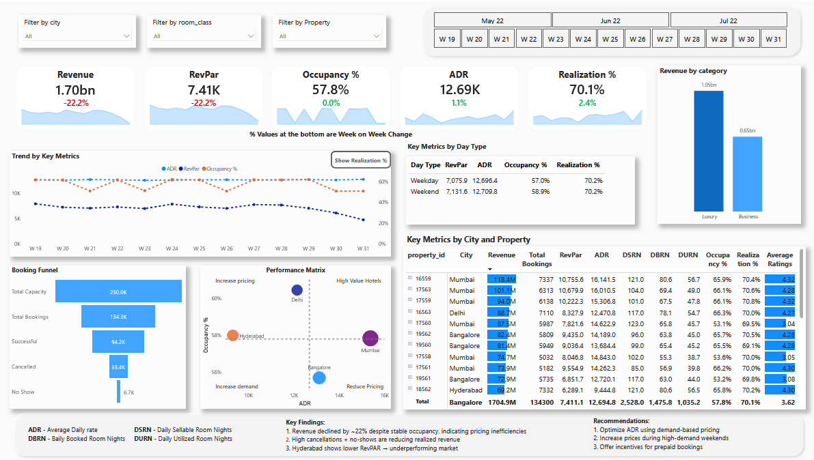
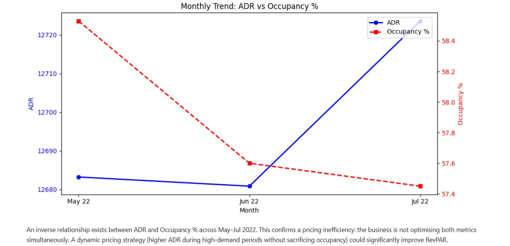

# Hospitality Revenue & Occupancy Analytics

End-to-end analysis of 134K+ hotel bookings across 4 Indian cities (May–Jul 2022), combining Python EDA with a Power BI executive dashboard to uncover pricing, cancellation, and service-quality inefficiencies.

## Overview

  

  

* Domain - Hospitality / Hotel Revenue Management
* Tools - Python (Pandas, Matplotlib, Seaborn), Power BI, DAX
* Dataset - 5 tables · 134,576 bookings · 25 properties · 4 cities
* Deliverables - Jupyter Notebook (EDA) + Power BI Dashboard (.pbix)

---

## Business Problem

The hospitality industry faces challenges in maximizing revenue while balancing occupancy, pricing, and booking efficiency.

Management required a centralized solution to:
* Monitor revenue performance across properties and cities.
* Track KPIs such as RevPAR, ADR, Occupancy %, and Realization %.
* Identify revenue leakage caused by cancellations and no-shows.
* Understand customer behavior and booking patterns.
* Support pricing and demand-management decisions.

This project asks one question:
* *Is revenue being lost because of low demand, or because of how rooms are priced and managed?*

---

## Part 1 — Python EDA
Notebook: [`Hospitality_Analysis.ipynb`](https://github.com/adityadhiman96/PowerBI-Hospitality-Revenue-Performance-Dashboard/blob/main/notebook/Hospitality_Analysis.ipynb)
* Data Cleaning
  - Removed records with invalid `no_guests` (≤0) — <1% of data
  - Applied the 3-sigma rule to detect and remove outliers in `revenue_generated`
  - Validated `revenue_realized` outliers against room category (RT4 / Presidential) before deciding not to remove them — avoided over-cleaning legitimate       luxury pricing
  - Filled missing `capacity` values using median
  - Removed rows where `successful_bookings > capacity` (logically invalid)
  - Retained ~80K null values in `ratings_given` rather than imputing — avoided distorting guest sentiment data

* KPIs Engineered
  - ADR (Average Daily Rate)	Total Revenue ÷ Total Bookings
  - RevPAR (Revenue per Available Room)	Total Revenue ÷ Total Capacity
  - Occupancy %	Successful Bookings ÷ Capacity × 100
  - Realization %	Revenue Realized ÷ Revenue Generated × 100
  - Cancellation Rate	Cancelled Bookings ÷ Total Bookings × 100

* Independent Analysis (Ad-Hoc)
  - Occupancy by room class, city, and weekday vs. weekend
  - Month-on-month revenue trends
  - ADR vs. Occupancy % - dual-axis monthly trend
  - Revenue per booking by platform
  - Cancellation rate by city
  - Rating distribution by room class (Seaborn boxplot)

## Part 2 — Power BI Dashboard
File: [`hospitality_dashboard.pbix`](https://app.powerbi.com/view?r=eyJrIjoiZDMxYTQyODgtZGRiZC00ZjFlLWEzYzAtMzM5ZDEzZTEwZmNkIiwidCI6ImM2ZTU0OWIzLTVmNDUtNDAzMi1hYWU5LWQ0MjQ0ZGM1YjJjNCJ9)

* An executive dashboard built on the cleaned/aggregated data, featuring:
  - KPI cards with week-over-week change: Revenue, RevPAR, ADR, Occupancy %, Realization %
  - Trend chart tracking ADR, RevPAR, and Occupancy % across 13 weeks
  - Realization % and Average ADR acorss all booking platforms
  - Booking Funnel: Capacity > Total Bookings > Successful > Cancelled > No-Show
  - Performance Matrix: City & Property-level drill-down scatter of ADR vs. Occupancy % to flag pricing/demand mismatches
  - Breakdowns by day type (weekday/weekend), city, property, and revenue category (Luxury vs. Business)
  - Built-in Key Findings and Recommendations panel for stakeholder consumption

* Data Model
  - Designed using Star Schema for performance optimization
  - Tables:
    Fact Table - Bookings, Aggregated_Bookings
    Dimension Tables - Date, Hotels, Room

* Key Findings
  -	Inverse ADR–Occupancy relationship — May had high occupancy/low ADR; July had high ADR/low occupancy
  -	Revenue per booking is nearly flat across platforms (Direct Offline ₹12,791 vs. Direct Online ₹12,634)
  -	Cancellation rates are uniform across cities (~24.6%–25.0%)
  -	Ratings are nearly identical across room classes (3.59–3.69)
  -	Revenue declined ~22% despite stable occupancy

* Business Impact
- Pricing is not optimized properties trade off rate vs. volume instead of balancing both, directly limiting RevPAR
- Platform mix is not the lever, overall demand generation matters more than channel optimization
- Cancellations are a policy-level problem (prepayment, refund terms), not a city-specific demand issue
- Guest satisfaction is driven by overall service quality, not room tier, service investment outperforms room upgrades
- Confirms the pricing inefficiency identified in Python, the same signal shows up independently in both analyses

---

## Recommendations
* Dynamic pricing - raise ADR during high-occupancy periods instead of trading rate for volume
* Cancellation policy review - introduce prepayment/cancellation fees given the uniform ~25% rate across all cities
* Service quality investment - prioritize staff training and guest experience over premium room upgrades
* Direct booking incentives - leverage the slightly higher per-booking revenue from Direct Offline through loyalty programs

---

## The One-Line Takeaway
-> Revenue is not seeing and increasing trend because of **pricing strategy, cancellation policy, and service consistency**, all of the problems are operationally fixable without acquiring new customers.

---

## Preview

* [Dashboard](images/Dashboard.png)
* [Data Model](images/Data_Model.png)

---

## Tech Stack
`Python` · `Pandas` · `Matplotlib` · `Seaborn` · `Power BI` · `DAX` · `Power Query`

---

## What I Learned

* Translating business problems into analytical dashboards
* Identifying revenue drivers using KPIs like RevPAR & ADR
* Designing dashboards for **decision-making, not just visualization**

---

## Author
Aditya Dhiman
